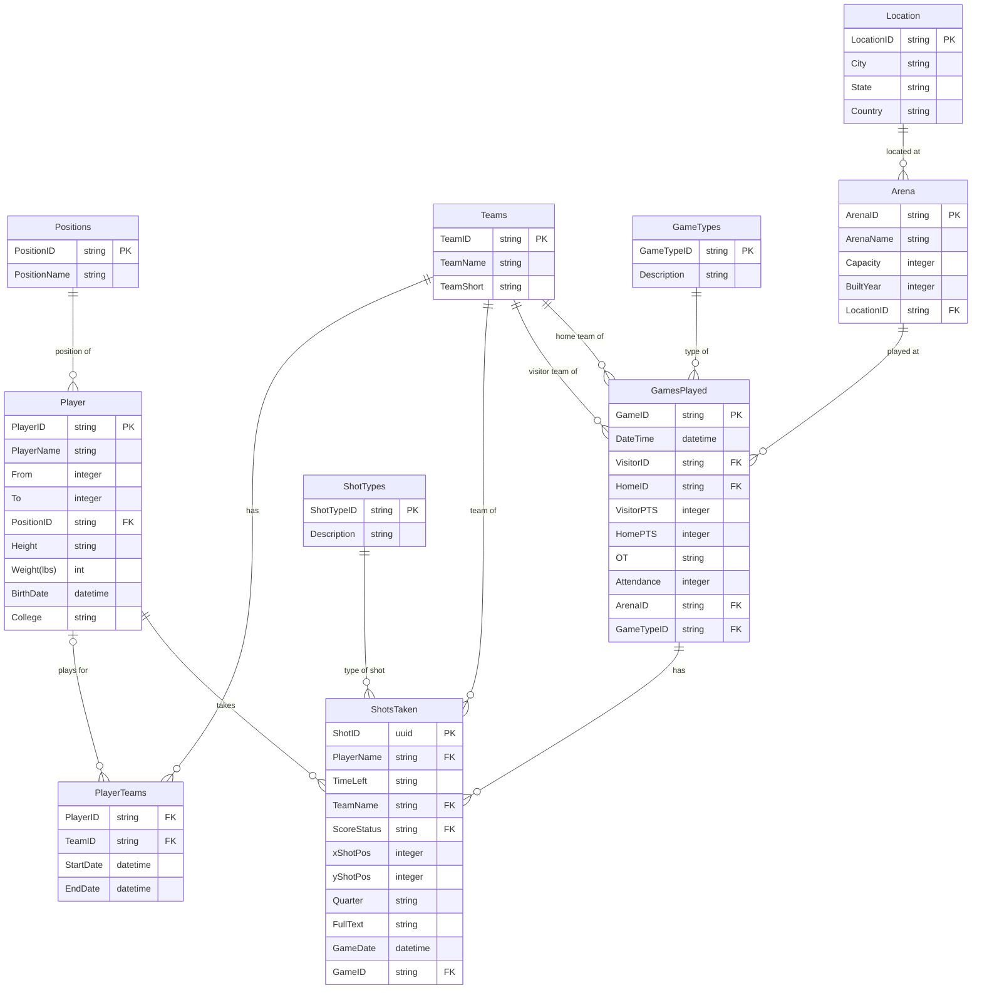

# NBA Data API

## Overview

The `nba-api` is a meticulously crafted FastAPI application that serves as a gateway to a treasure trove of NBA data spanning from 2000 to 2023. Not only does it provide a user-friendly interface to a robust MSSQL backend, but its design also emphasizes scalability, modularity, and performance. Whether you're looking to fetch data about specific players, analyze shot patterns, or just get an overview of NBA teams, this API has got you covered.

**Note**: Direct access to the hosted API will be granted once it's officially hosted. Stay tuned for updates!


## Table of Contents

- [NBA Data API](#nba-data-api)
  - [Overview](#overview)
  - [Table of Contents](#table-of-contents)
  - [Key Features](#key-features)
  - [Installation (For Local Testing Only)](#installation-for-local-testing-only)
    - [Usage](#usage)
    - [Endpoints](#endpoints)
      - [Players](#players)
      - [Shots Taken](#shots-taken)
      - [Tables](#tables)
      - [Positions](#positions)
      - [Utilities](#utilities)
  - [Database Architecture](#database-architecture)
  - [Technology Stack](#technology-stack)
  - [Logging](#logging)
  - [License](#license)
  - [Feedback and Suggestions](#feedback-and-suggestions)
    - [How to Provide Feedback](#how-to-provide-feedback)
    - [Code of Conduct](#code-of-conduct)


## Key Features

1. **Data-Rich Endpoints**: Provides a range of endpoints from fetching player statistics to detailed shot analytics.
2. **Error Handling**: Well-defined error handling ensures the user always receives clear and informative feedback.
3. **Database Integration**: Seamlessly interfaces with a comprehensive MSSQL database structured to efficiently store vast NBA datasets.
4. **Dynamic Logging**: Features an adaptable logging system which offers insights into application performance and potential bottlenecks.
5. **Documentation**: Integrated with FastAPI's automatic interactive API documentation.


## Installation (For Local Testing Only)

If you wish to test the API locally, follow these steps:

1. Clone the repository.
2. Install the required packages using the following command:

```bash
pip install -r requirements.txt
```

3. Set up your environment variables. You can reference the `.env` file for required environment variables.

4. Run the application with:

```bash
uvicorn app.main:app --reload
```

### Usage

Once the application is running locally, you can access the API documentation at `/docs` (typically `http://127.0.0.1:8000/docs`). 

### Endpoints

#### Players

- `GET /v1/api/players`: Fetch player information based on player name or ID. 

#### Shots Taken

- `GET /v1/api/shots`: Retrieve shots taken by players or teams, with various filtering options.

#### Tables

- `GET /v1/api/tables`: Get a list of available tables in the database.

#### Positions

- `GET /v1/api/positions`: Fetch information about various positions in the NBA.

#### Utilities

- `GET /v1/api/utils/list_endpoints`: List all available endpoints in the API.

For more detailed information about each endpoint, parameters, and response structures, refer to the API documentation at `/docs`.


## Database Architecture

The underlying database is structured to provide a holistic view of the NBA world. From individual player stats to game outcomes, every piece of data is interlinked to give a complete picture. Below is a visual representation of the database schema:



For a more in-depth look into the database and its tables, check out the [Database Description.md](./info/Database%20Description.md).

## Technology Stack

- **FastAPI**: A modern, fast (high-performance), web framework for building APIs with Python 3.7+ based on standard Python type hints.
- **SQLAlchemy**: A SQL toolkit and Object-Relational Mapping (ORM) library for Python, providing an efficient way to interface with databases.
- **Pydantic**: Data validation and settings management using Python type annotations.
- **MSSQL**: A relational database management system developed by Microsoft.


## Logging

Logs are maintained in the `app.log` file. The log format includes the timestamp, logger name, log level, and the actual message. For example:

```
2023-09-23 12:00:00 - app.api.endpoints.players - INFO - Fetching players with player_name: John, player_id: 5, limit: 10
```


## License

This project is licensed under the MIT License. For the full license text, please refer to the `LICENSE` file in the project repository.


## Feedback and Suggestions

While I am not actively seeking code contributions at this moment since it is a relatively small project, I value your feedback and suggestions. Your insights can help me make this project even better!

### How to Provide Feedback

1. **Issues**: If you encounter any issues or have feature requests, please open a [new issue](https://github.com/dizzydwarfus/nba-api/issues/new) on the GitHub repository. Describe the issue in detail, and I'll do our best to address it.
2. **Discussions**: I'm open to general feedback, suggestions, or discussions. Please use the [discussions tab](https://github.com/dizzydwarfus/nba-api/discussions) on our GitHub repository for this purpose.
3. **Contact**: If you have specific queries or want to discuss something privately, feel free to reach out via [email](mailto:lianzhenyang1998@gmail.com) or reach me via [LinkedIn](https://www.linkedin.com/in/zhenyang-lian/).

### Code of Conduct

I expect everyone who participates in discussions or provides feedback to follow a respectful and constructive approach. Let's keep our community positive and welcoming!
