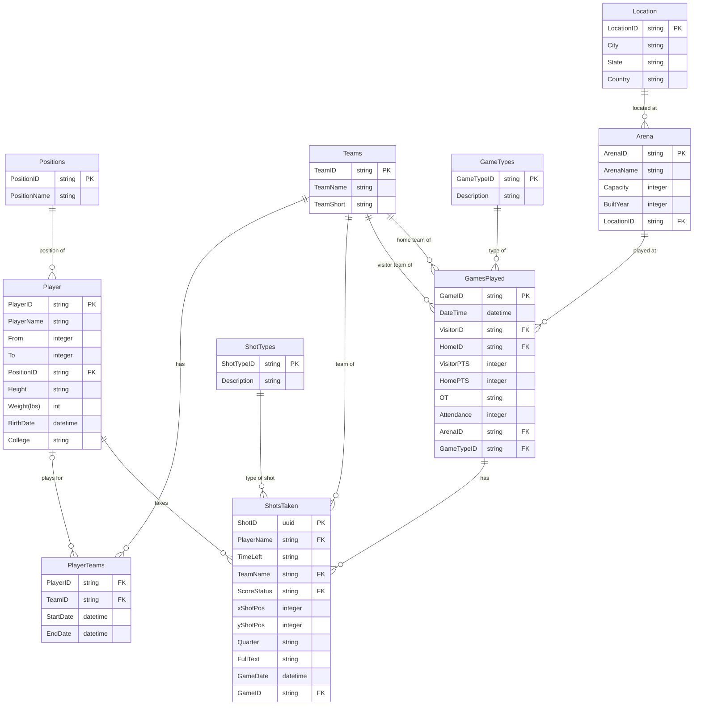

## Database Structure

The `nba-api` interfaces with a backend MSSQL database designed to comprehensively capture details related to NBA games, players, shots, and other associated entities. The database is normalized and consists of various tables that store information about games played, individual players, the shots they've taken, the arenas where games are hosted, and more.

Below is an Entity Relationship Diagram (ERD) that visualizes the structure of the database:

### Key Points:
- **GamesPlayed**: This table captures details about individual games, including the teams that played, scores, attendance, and the type of game.
- **Player**: Information about individual NBA players, including their name, active years, physical attributes, and the position they play.
- **ShotsTaken**: This table records every shot taken, detailing the player, the game in which the shot was taken, the position on the court, and the outcome.
- **Teams**: Details of NBA teams.
- **Arena**: Information about the arenas where games are played.
- **Location**: Captures the location of each arena.
- **PlayerTeams**: A bridging table that records which player played for which team and during what period.
- **Positions**, **ShotTypes**, and **GameTypes**: These are lookup tables that provide descriptions for various categories.

Relationships between these entities are depicted in the ERD, showing how data is interrelated and can be queried to provide comprehensive insights.
